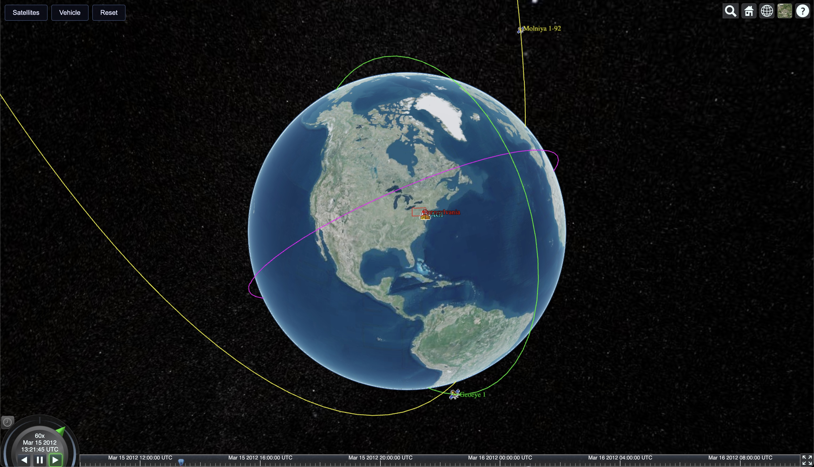
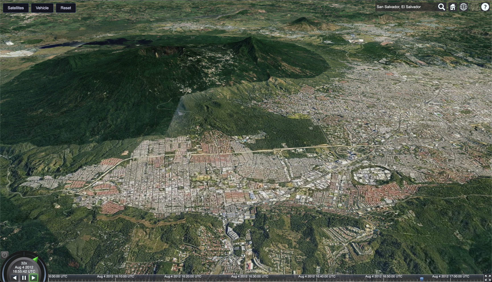
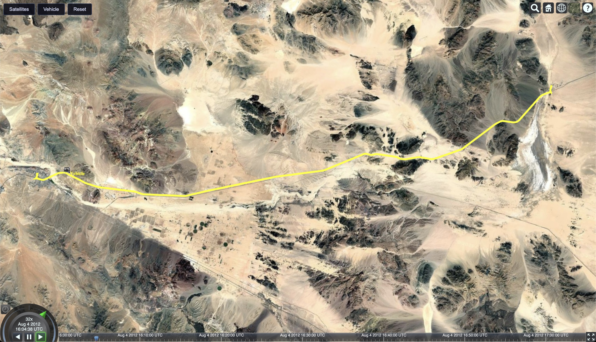

# leptos-cesium

`leptos-cesium` provides a CesiumJS component library for the [Leptos](https://github.com/leptos-rs/leptos) framework. It mirrors the ergonomics of `leptos-leaflet` while exposing Cesium concepts (viewer, entities, data sources, 3D tiles) through idiomatic Leptos components.


## Gallery

<table>
  <tr>
    <td width="33%" align="center">
      
      <br>
      <b>Satellite Tracking</b>
      <br>
      Visualize satellite orbits and trajectories
    </td>
    <td width="33%" align="center">
      
      <br>
      <b>3D Terrain</b>
      <br>
      High-resolution terrain and imagery
    </td>
    <td width="33%" align="center">
      
      <br>
      <b>Vehicle Paths</b>
      <br>
      Track vehicles and paths over terrain
    </td>
  </tr>
</table>

## Repository Layout

- `leptos-cesium/` – main library crate (bindings, components, core utilities)
- `examples/` – example Leptos apps showcasing Cesium usage
- `vendor/Cesium/<version>/` – canonical location for downloaded Cesium bundles (populated via the helper script)
- `scripts/` – utility scripts (`sync_cesium_assets.sh`)

## Getting Started

### 1. Install prerequisites

- Rust toolchain with the `wasm32-unknown-unknown` target
- `trunk` CLI (`cargo install trunk`)

### 2. Configure your Cesium Ion token

Copy the template and add your token:

```bash
cp .env.example .env.local
# Edit .env.local and paste your token
```

Get your free token from: https://ion.cesium.com/tokens

### 3. Install Cesium vendor assets

Download and sync Cesium assets to examples:

```bash
# Download Cesium-1.135.zip from https://cesium.com/downloads/
# Extract to project root, then:
./scripts/sync_cesium_assets.sh
```

The script expects Cesium at `vendor/Cesium/1.135/Build/Cesium` and creates symlinks in each example's `public/Cesium` directory.

### 4. Run examples

**Simple viewer (basic globe):**
```bash
cd examples/simple-viewer
trunk serve --open
```

**Entities example (shapes and materials):**
```bash
cd examples/with-entities
trunk serve --open
```
Demonstrates declarative entity components: 2D shapes (rectangles, polygons, ellipses), 3D primitives (boxes, spheres, cylinders), paths (polylines, corridors, walls), and various materials (colors, stripes, checkerboard, glow).

**CZML data loading (satellites, animations):**
```bash
cd examples/czml-viewer
trunk serve --open
```
Demonstrates CZML data source loading with automatic clock synchronization and camera controls.

**GeoJSON data loading (maps, geographic features):**
```bash
cd examples/geojson
trunk serve --open
```
Demonstrates GeoJSON data source loading with custom styling for polygons, polylines, and point markers. Features reactive layer switching and styling options.

**Camera controls (animated positioning):**
```bash
cd examples/camera-control
trunk serve --open
```
Demonstrates declarative camera controls including fly-to animations, view positioning, and camera movements.

**Server-side rendering:**
```bash
cd examples/with-server
cargo leptos watch
```
Visit http://localhost:3000

### What happens at build time?

1. **Environment loading**: Cargo reads `CESIUM_ION_TOKEN` from `.env.local` at build time
2. **Token passing**: Token is passed to `<ViewerContainer ion_token=... />` component prop
3. **Asset copying**: Trunk mirrors `public/Cesium/` into dist directory via `copy-dir` directive
4. **Cesium loading**: HTML loads `Cesium.js` synchronously in `<head>`
5. **WASM loading**: Trunk injects the WASM module at the `<link data-trunk rel="rust">` location
6. **Viewer creation**: Component sets `Cesium.Ion.defaultAccessToken` and creates viewer instance

### Development Tips

- Run `cargo check --target wasm32-unknown-unknown` from the repository root to check library code
- When updating the Cesium bundle, rerun `./scripts/sync_cesium_assets.sh` and restart Trunk
- If you rotate Ion tokens, edit `.env.local` and rebuild
- For troubleshooting, see `CLAUDE.md`

## Features

### Declarative Components

Create Cesium entities with clean, type-safe Rust:

```rust
use leptos::prelude::*;
use leptos_cesium::prelude::*;

view! {
    <ViewerContainer ion_token=token>
        <Entity name="My Rectangle">
            <RectangleGraphics
                coordinates=Rectangle::from_degrees(-110.0, 20.0, -80.0, 25.0)
                material=Some(Material::color(Color::red().with_alpha(0.5)))
                outline=Some(true)
                outline_color=Some(Color::black())
            />
        </Entity>
    </ViewerContainer>
}
```

### Supported Graphics

**2D Shapes:**
- **RectangleGraphics** - Rectangles on the globe surface
- **PolygonGraphics** - Polygons with optional holes
- **EllipseGraphics** - Ellipses with rotation support

**3D Primitives:**
- **BoxGraphics** - Cuboid shapes with customizable dimensions
- **EllipsoidGraphics** - Spheres and ellipsoids with radii control
- **CylinderGraphics** - Cylinders and cones with adjustable radii

**Paths & Volumes:**
- **PolylineGraphics** - Lines with width and material styling
- **WallGraphics** - Vertical walls with height control
- **CorridorGraphics** - Corridor paths with width and extrusion
- **PolylineVolumeGraphics** - Custom 2D shapes extruded along paths

**Points & Markers:**
- **PointGraphics** - Point markers with pixel size and color customization

### Materials

All materials use a fluent builder API for clean, type-safe configuration:

**Color Material:**
```rust
Material::color(Color::red().with_alpha(0.5))
```

**Stripe Material:**
```rust
Material::stripe(
    StripeOptions::new()
        .even_color(Color::white())
        .odd_color(Color::blue())
        .repeat(5.0)
        .build()
)
```

**Checkerboard Material:**
```rust
Material::checkerboard(
    CheckerboardOptions::new()
        .even_color(Color::white())
        .odd_color(Color::black())
        .repeat(Cartesian2::new(20.0, 6.0))
        .build()
)
```

**Polyline Glow Material:**
```rust
Material::polyline_glow(
    PolylineGlowOptions::new()
        .color(Color::deepskyblue())
        .glow_power(0.25)
        .build()
)
```

### Camera Controls

Declarative camera positioning and animation:

```rust
use leptos_cesium::prelude::*;

view! {
    <ViewerContainer ion_token=token>
        // Instant camera positioning
        <CameraSetView
            destination=Cartesian3::from_degrees(-75.0, 40.0, 1000.0)
            orientation=HeadingPitchRoll::new(0.0, -90.0, 0.0)
        />

        // Animated flight to location
        <CameraFlyTo
            destination=Cartesian3::from_degrees(-122.4, 37.8, 5000.0)
            duration=Some(3.0)
        />

        // Fly to home view
        <CameraFlyHome duration=Some(2.0) />

        // Zoom to entity bounds
        <CameraFlyToBoundingSphere
            bounding_sphere=entity_bounds
            offset=Some(HeadingPitchRange::new(0.0, -45.0, 1000.0))
        />

        // Reset clock to current time
        <ClockReset />
    </ViewerContainer>
}
```

### Data Sources

**CZML Data Source:**

Load dynamic data from CZML format:

```rust
use leptos_cesium::prelude::*;

view! {
    <ViewerContainer ion_token=token>
        <CzmlDataSource
            url="satellite-orbit.czml"
            clear_existing=true
        />
    </ViewerContainer>
}
```

CZML data sources automatically synchronize the viewer clock with animation timelines.

**GeoJSON Data Source:**

Load and style GeoJSON or TopoJSON data:

```rust
use leptos_cesium::prelude::*;

view! {
    <ViewerContainer ion_token=token>
        <GeoJsonDataSource
            url="data/countries.geojson"
            stroke=Color::blue()
            stroke_width=2.0
            fill=Color::cyan().with_alpha(0.3)
            marker_color=Color::red()
            marker_size=24.0
            clamp_to_ground=false
        />
    </ViewerContainer>
}
```

Supports extensive styling options for polygons, polylines, and point markers.

### 3D Tiles

Load high-resolution 3D tile datasets:

**Google Photorealistic 3D Tiles:**

```rust
use leptos_cesium::prelude::*;

view! {
    <ViewerContainer ion_token=token>
        <GooglePhotorealistic3DTiles
            google_api_key=None  // Uses Cesium Ion asset by default
            cache_bytes=Some(1536000000)
            enable_collision=Some(true)
        />
    </ViewerContainer>
}
```

Loads Google's photorealistic 3D tiles via Cesium Ion or directly with a Google Maps API key.

## Project Status

**Implemented:**
- ✅ ViewerContainer with Ion token support and configurable UI widgets
- ✅ Entity component with declarative graphics
- ✅ 2D Graphics: Rectangle, Polygon, Ellipse
- ✅ 3D Primitives: Box, Ellipsoid, Cylinder
- ✅ Paths & Volumes: Polyline, Wall, Corridor, PolylineVolume
- ✅ Points: PointGraphics with pixel size and color control
- ✅ Materials: Color, Stripe, Checkerboard, PolylineGlow (all with builder APIs)
- ✅ Camera Controls: CameraFlyTo, CameraSetView, CameraFlyHome, CameraFlyToBoundingSphere
- ✅ Clock Controls: ClockReset for animation timeline management
- ✅ Data Sources: CZML with automatic clock synchronization, GeoJSON with extensive styling options
- ✅ 3D Tiles: Google Photorealistic 3D Tiles with cache and collision controls
- ✅ Coordinate Helpers: Cartesian2, Cartesian3, Rectangle, PolygonHierarchy
- ✅ Math Utilities: to_radians, to_degrees, HeadingPitchRoll, HeadingPitchRange
- ✅ Server-side rendering support with thread-safe JsValue wrappers
- ✅ Builder APIs for complex options (FlyToOptions, SetViewOptions, StripeOptions, GeoJsonLoadOptions, etc.)

**Planned:**
- 🔲 Additional graphics types (Model, Billboard, Label, Path)
- 🔲 Additional data sources (KML, GPX)
- 🔲 Custom 3D Tileset loading (from URL or Ion asset ID)
- 🔲 Event system (click, hover, entity selection)
- 🔲 Additional camera controls (lookAt, viewer tracking)
- 🔲 Imagery providers (custom base layers)
- 🔲 Terrain providers (custom terrain data)
- 🔲 PostProcessing effects
- 🔲 Primitives API (low-level rendering)

Contributions are welcome!
