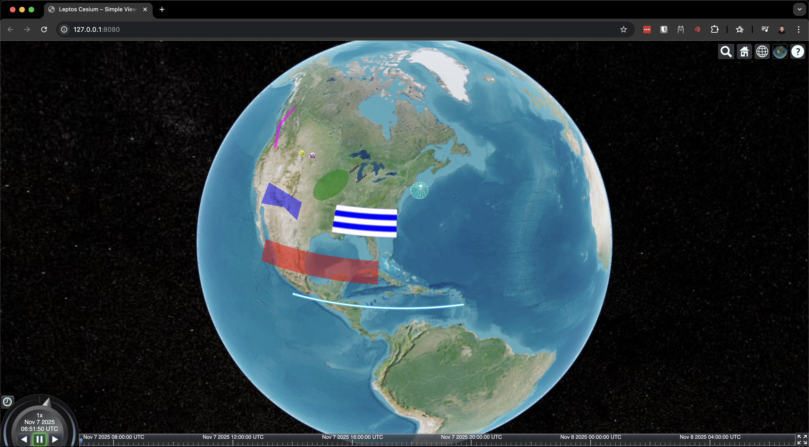

# leptos-cesium (WIP)

`leptos-cesium` will provide a CesiumJS component library for the [Leptos](https://github.com/leptos-rs/leptos) framework. The goal is to mirror the ergonomics of `leptos-leaflet` while exposing Cesium concepts (viewer, entities, data sources, events) through idiomatic Leptos components.



## Repository Layout

- `leptos-cesium/` – main library crate (bindings, components, core utilities)
- `examples/` – example Leptos apps showcasing Cesium usage (WIP)
- `vendor/Cesium/<version>/` – canonical location for downloaded Cesium bundles (populated via the helper script)
- `scripts/` – utility scripts (`sync_cesium_assets.sh`)

## Getting Started

### 1. Install prerequisites

- Rust toolchain with the `wasm32-unknown-unknown` target
- `trunk` CLI (`cargo install trunk`)

### 2. Configure your Cesium Ion token

Copy the template and add your token:

```bash
cp .env.example .env.local
# Edit .env.local and paste your token
```

Get your free token from: https://ion.cesium.com/tokens

### 3. Install Cesium vendor assets

Download and sync Cesium assets to examples:

```bash
# Download Cesium-1.135.zip from https://cesium.com/downloads/
# Extract to project root, then:
./scripts/sync_cesium_assets.sh
```

The script expects Cesium at `vendor/Cesium/1.135/Build/Cesium` and creates symlinks in each example's `public/Cesium` directory.

### 4. Run examples

**Simple viewer (basic globe):**
```bash
cd examples/simple-viewer
trunk serve --open
```

**Entities example (shapes and materials):**
```bash
cd examples/with-entities
trunk serve --open
```
Demonstrates declarative entity components: 2D shapes (rectangles, polygons, ellipses), 3D primitives (boxes, spheres, cylinders), paths (polylines, corridors, walls), and various materials (colors, stripes, checkerboard, glow).

**Server-side rendering:**
```bash
cd examples/with-server
cargo leptos watch
```
Visit http://localhost:3000

### What happens at build time?

1. **Environment loading**: Cargo reads `CESIUM_ION_TOKEN` from `.env.local` at build time
2. **Token passing**: Token is passed to `<ViewerContainer ion_token=... />` component prop
3. **Asset copying**: Trunk mirrors `public/Cesium/` into dist directory via `copy-dir` directive
4. **Cesium loading**: HTML loads `Cesium.js` synchronously in `<head>`
5. **WASM loading**: Trunk injects the WASM module at the `<link data-trunk rel="rust">` location
6. **Viewer creation**: Component sets `Cesium.Ion.defaultAccessToken` and creates viewer instance

### Development Tips

- Run `cargo check --target wasm32-unknown-unknown` from the repository root to check library code
- When updating the Cesium bundle, rerun `./scripts/sync_cesium_assets.sh` and restart Trunk
- If you rotate Ion tokens, edit `.env.local` and rebuild
- For troubleshooting, see `CLAUDE.md`

## Features

### Declarative Components

Create Cesium entities with clean, type-safe Rust:

```rust
use leptos::prelude::*;
use leptos_cesium::prelude::*;

view! {
    <ViewerContainer ion_token=token>
        <Entity name="My Rectangle">
            <RectangleGraphics
                coordinates=Rectangle::from_degrees(-110.0, 20.0, -80.0, 25.0)
                material=Some(Material::color(Color::red().with_alpha(0.5)))
                outline=Some(true)
                outline_color=Some(Color::black())
            />
        </Entity>
    </ViewerContainer>
}
```

### Supported Graphics

**2D Shapes:**
- **RectangleGraphics** - Rectangles on the globe surface
- **PolygonGraphics** - Polygons with optional holes
- **EllipseGraphics** - Ellipses with rotation support

**3D Primitives:**
- **BoxGraphics** - Cuboid shapes with customizable dimensions
- **EllipsoidGraphics** - Spheres and ellipsoids with radii control
- **CylinderGraphics** - Cylinders and cones with adjustable radii

**Paths & Volumes:**
- **PolylineGraphics** - Lines with width and material styling
- **WallGraphics** - Vertical walls with height control
- **CorridorGraphics** - Corridor paths with width and extrusion
- **PolylineVolumeGraphics** - Custom 2D shapes extruded along paths

### Materials

All materials use a fluent builder API for clean, type-safe configuration:

**Color Material:**
```rust
Material::color(Color::red().with_alpha(0.5))
```

**Stripe Material:**
```rust
Material::stripe(
    StripeOptions::new()
        .even_color(Color::white())
        .odd_color(Color::blue())
        .repeat(5.0)
        .build()
)
```

**Checkerboard Material:**
```rust
Material::checkerboard(
    CheckerboardOptions::new()
        .even_color(Color::white())
        .odd_color(Color::black())
        .repeat(Cartesian2::new(20.0, 6.0))
        .build()
)
```

**Polyline Glow Material:**
```rust
Material::polyline_glow(
    PolylineGlowOptions::new()
        .color(Color::deepskyblue())
        .glow_power(0.25)
        .build()
)
```

## Project Status

**Implemented:**
- ✅ ViewerContainer with Ion token support
- ✅ Entity component with declarative graphics
- ✅ 2D Graphics: Rectangle, Polygon, Ellipse
- ✅ 3D Primitives: Box, Ellipsoid, Cylinder
- ✅ Paths & Volumes: Polyline, Wall, Corridor, PolylineVolume
- ✅ Materials: Color, Stripe, Checkerboard, PolylineGlow
- ✅ Viewer controls: zoomTo, entities access
- ✅ Server-side rendering support
- ✅ Thread-safe JsValue wrappers
- ✅ Cartesian2/Cartesian3 coordinate helpers

**In Progress:**
- 🚧 Additional graphics types (Model, Billboard, Label, etc.)
- 🚧 Data source components (GeoJSON, CZML, KML)
- 🚧 Event system (click, hover, etc.)
- 🚧 Camera controls (flyTo, lookAt, etc.)
- 🚧 Imagery providers
- 🚧 Terrain providers

Contributions are welcome!
