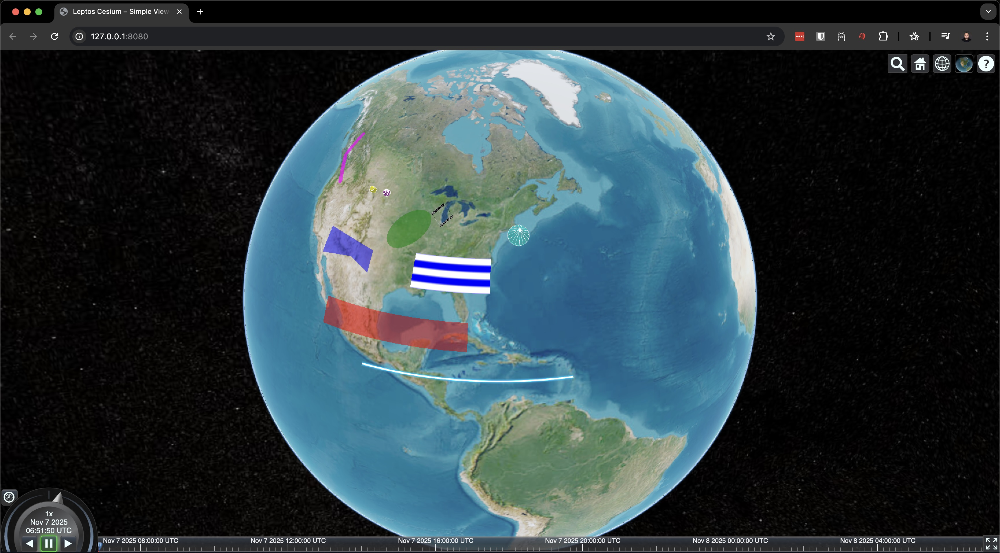
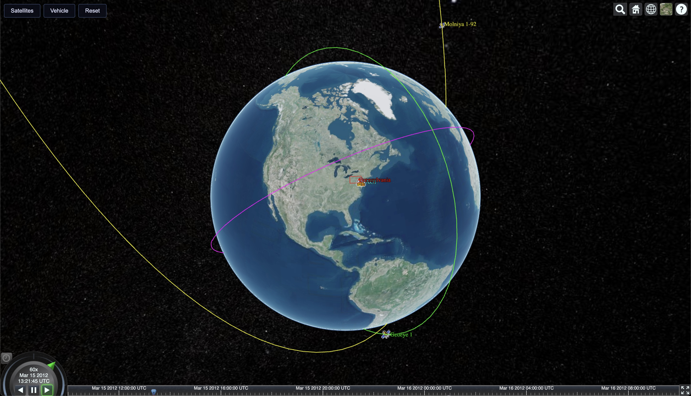
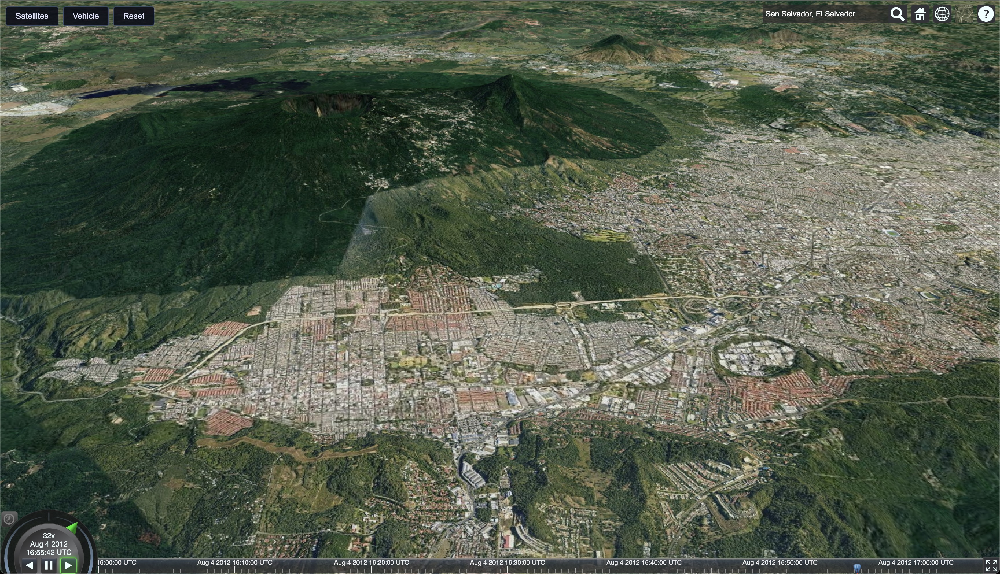
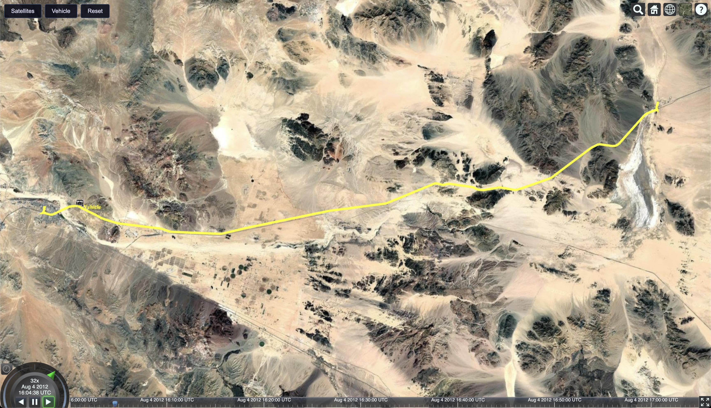

# leptos-cesium

`leptos-cesium` provides a CesiumJS component library for the [Leptos](https://github.com/leptos-rs/leptos) framework (0.8.15). It uses standard Rust types (glam, geo-types, palette) for SSR compatibility, exposing Cesium concepts (viewer, entities, data sources, 3D tiles) through idiomatic Leptos components.



## Gallery

<table>
  <tr>
    <td width="33%" align="center">
      
      <br>
      <b>Satellite Tracking</b>
      <br>
      Visualize satellite orbits and trajectories
    </td>
    <td width="33%" align="center">
      
      <br>
      <b>3D Terrain</b>
      <br>
      High-resolution terrain and imagery
    </td>
    <td width="33%" align="center">
      
      <br>
      <b>Vehicle Paths</b>
      <br>
      Track vehicles and paths over terrain
    </td>
  </tr>
</table>

## Repository Layout

- `leptos-cesium/` – main library crate (bindings, components, core utilities)
- `examples/` – example Leptos apps showcasing Cesium usage

## Getting Started

### 1. Install prerequisites

- Rust toolchain with the `wasm32-unknown-unknown` target
- `trunk` CLI (`cargo install trunk`)

### 2. Configure your Cesium Ion token

Copy the template and add your token:

```bash
cp .env.example .env.local
# Edit .env.local and paste your token
```

Get your free token from: https://ion.cesium.com/tokens

### 3. Run examples

**Simple viewer (basic globe):**
```bash
cd examples/simple-viewer
trunk serve --open
```

**Entities example (shapes and materials):**
```bash
cd examples/with-entities
trunk serve --open
```
Demonstrates declarative entity components: 2D shapes (rectangles, polygons, ellipses), 3D primitives (boxes, spheres, cylinders), paths (polylines, corridors, walls), and various materials (colors, stripes, checkerboard, glow).

**CZML data loading (satellites, animations):**
```bash
cd examples/czml-viewer
trunk serve --open
```
Demonstrates CZML data source loading and camera controls.

**Pinned image billboard (non-CZML):**
```bash
cd examples/pinned-image
trunk serve --open
```
Demonstrates `BillboardGraphics` with `MediaSource::Url`.

**Pinned video material (non-CZML):**
```bash
cd examples/pinned-video-material
trunk serve --open
```
Demonstrates `ImageMaterialPropertyBuilder` + `Material::image(...)` on a rectangle.

**Pinned video overlay (non-CZML):**
```bash
cd examples/pinned-video-overlay
trunk serve --open
```
Demonstrates a native HTML `<video>` visually pinned to a globe position via `VideoOverlay`.

**Pinned YouTube overlay (HTML iframe):**
```bash
cd examples/pinned-youtube-overlay
trunk serve --open
```
Demonstrates an official YouTube iframe visually pinned to a globe position via `YouTubeOverlay`.

**CZML overlay media animation:**
```bash
cd examples/czml-overlay-media
trunk serve --open
```
Demonstrates overlay-based CZML media tracking from flattened `properties.media_*` fields using moving entity positions.

**GeoJSON data loading (maps, geographic features):**
```bash
cd examples/geojson
trunk serve --open
```
Demonstrates GeoJSON data source loading with custom styling for polygons, polylines, and point markers. Features reactive layer switching and styling options.

**Camera controls:**
```bash
cd examples/camera-control
trunk serve --open
```
Demonstrates parity-focused camera interactions: setView, flyTo, flyHome, move/zoom actions, and ScreenSpaceCameraController toggles.

**Custom selection UI (reactive selected entity panel):**
```bash
cd examples/custom-selection
trunk serve --open
```
Demonstrates replacing the default Cesium InfoBox with a Leptos-driven custom selection panel.

**Google Photorealistic 3D Tiles:**
```bash
cd examples/google-3d-tiles
trunk serve --open
```
Demonstrates loading Cesium Ion/Google 3D Tiles with cache and collision configuration.

**Server-side rendering:**
```bash
cd examples/with-server
cargo leptos watch
```
Visit http://localhost:3000

### What happens at build time?

1. **Environment loading**: Cargo reads `CESIUM_ION_TOKEN` from `.env.local` at build time
2. **Token passing**: Token is passed to `<ViewerContainer ion_token=... />` component prop
3. **Cesium loading**: HTML loads `Cesium.js` from CDN synchronously in `<head>`
4. **WASM loading**: Trunk injects the WASM module at the `<link data-trunk rel="rust">` location
5. **Viewer creation**: Component sets CDN base URL, `Cesium.Ion.defaultAccessToken`, and creates viewer instance

### Development Tips

- Run `cargo check --workspace` from the repository root for a full compile check
- Run `cargo test -p leptos-cesium --lib` for native unit tests
- Run `cargo test -p leptos-cesium --lib --target wasm32-unknown-unknown --no-run` to verify wasm test compilation
- Cesium is loaded from CDN (cesium.com) - no local assets required
- If you rotate Ion tokens, edit `.env.local` and rebuild
- For troubleshooting, see `CLAUDE.md`

## Features

### Declarative Components

Create Cesium entities with clean, type-safe Rust using standard ecosystem types:

```rust
use leptos::prelude::*;
use leptos_cesium::prelude::*;
use geo_types::coord;

view! {
    <ViewerContainer ion_token=token>
        <Entity name="My Rectangle">
            <RectangleGraphics
                coordinates=Rect::new(
                    coord! { x: -110.0, y: 20.0 },
                    coord! { x: -80.0, y: 25.0 }
                )
                material=Some(Material::color(Color::red().with_alpha(0.5)))
                outline=Some(true)
                outline_color=Some(Srgba::new(0.0, 0.0, 0.0, 1.0))
            />
        </Entity>
    </ViewerContainer>
}
```

### Supported Graphics

**2D Shapes:**
- **RectangleGraphics** - Rectangles on the globe surface
- **PolygonGraphics** - Polygons with optional holes
- **EllipseGraphics** - Ellipses with rotation support

**3D Primitives:**
- **BoxGraphics** - Cuboid shapes with customizable dimensions
- **EllipsoidGraphics** - Spheres and ellipsoids with radii control
- **CylinderGraphics** - Cylinders and cones with adjustable radii

**Paths & Volumes:**
- **PolylineGraphics** - Lines with width and material styling
- **WallGraphics** - Vertical walls with height control
- **CorridorGraphics** - Corridor paths with width and extrusion
- **PolylineVolumeGraphics** - Custom 2D shapes extruded along paths

**Points & Markers:**
- **PointGraphics** - Point markers with pixel size and color customization
- **BillboardGraphics** - Image/video/canvas billboards with origins, offsets, and scale
- **GeoAnchoredHtmlOverlay** - Screen-space HTML aligned to world coordinates
- **VideoOverlay** - Native HTML video wrapper built on globe-anchored HTML overlay support
- **YouTubeOverlay** - YouTube iframe wrapper built on globe-anchored HTML overlay support

### HTML Overlays

Use HTML overlays when you need DOM content to track a globe position instead of becoming a
Cesium material or billboard texture.

```rust
use leptos::prelude::*;
use leptos_cesium::prelude::*;

view! {
    <ViewerContainer ion_token=token>
        <GeoAnchoredHtmlOverlay
            position=DVec3::new(-122.4465, 37.8050, 120.0)
            pointer_events=true
        >
            <div
                style="padding: 10px 12px; border-radius: 12px; background: rgba(8, 17, 29, 0.9); color: white;"
            >
                "DOM content pinned to the globe"
            </div>
        </GeoAnchoredHtmlOverlay>
    </ViewerContainer>
}
```

For official YouTube embeds, use `YouTubeOverlay`:

```rust
view! {
    <ViewerContainer ion_token=token>
        <YouTubeOverlay
            video_id="M7lc1UVf-VE".to_string()
            position=DVec3::new(-122.4465, 37.8050, 140.0)
            width_px=420_u32
            height_px=236_u32
        />
    </ViewerContainer>
}
```

For native DOM video, use `VideoOverlay`:

```rust
view! {
    <ViewerContainer ion_token=token>
        <VideoOverlay
            src="https://cesium.com/public/SandcastleSampleData/big-buck-bunny_trailer.mp4".to_string()
            position=DVec3::new(-122.4465, 37.8050, 140.0)
            width_px=420_u32
            height_px=236_u32
            autoplay=true
            muted=true
            loop_video=true
            controls=true
        />
    </ViewerContainer>
}
```

If you need a true globe texture instead of a DOM overlay, keep using
`ImageMaterialPropertyBuilder` + `Material::image(...)` with a real `HTMLVideoElement`.

### Materials

All materials use a fluent builder API for clean, type-safe configuration:

**Color Material:**
```rust
Material::color(Color::red().with_alpha(0.5))
```

**Stripe Material:**
```rust
Material::stripe(
    StripeOptions::new()
        .even_color(Color::white())
        .odd_color(Color::blue())
        .repeat(5.0)
        .build()
)
```

**Checkerboard Material:**
```rust
Material::checkerboard(
    CheckerboardOptions::new()
        .even_color(Color::white())
        .odd_color(Color::black())
        .repeat(Cartesian2::new(20.0, 6.0))
        .build()
)
```

**Polyline Glow Material:**
```rust
Material::polyline_glow(
    PolylineGlowOptions::new()
        .color(Color::deepskyblue())
        .glow_power(0.25)
        .build()
)

// Image material (image URL/data URL/HTML media element)
Material::image(
    ImageMaterialPropertyBuilder::new()
        .image(MediaSource::Url("https://example.com/texture.png".to_string()))
        .build()
)
```

### Camera Controls

Cesium-parity camera control with typed destination/orientation unions and trigger-based actions:

```rust
use geo_types::coord;
use leptos::prelude::*;
use leptos_cesium::prelude::*;

let (fly_home_trigger, set_fly_home_trigger) = signal(());
// call set_fly_home_trigger.set(()) from an event handler to trigger the action

view! {
    <ViewerContainer ion_token=token>
        // Cesium Camera.setView (destination/orientation are optional in Cesium too)
        <CameraSetView
            destination=CameraDestination::Degrees(DVec3::new(-75.0, 40.0, 1000.0))
            orientation=CameraOrientation::HeadingPitchRoll(0.0, -0.7, 0.0)
        />

        // Cesium Camera.flyTo (destination required)
        <CameraFlyTo
            destination=CameraDestination::Rectangle(Rect::new(
                coord! { x: -130.0, y: 22.0 },
                coord! { x: -65.0, y: 50.0 },
            ))
            duration=3.0
        />

        // Triggered actions
        <CameraFlyHome trigger=fly_home_trigger duration=2.0 />

        // ScreenSpaceCameraController parity
        <CameraController
            enable_inputs=true
            enable_collision_detection=true
            minimum_zoom_distance=50.0
        />
    </ViewerContainer>
}
```

### Viewer Target Focus

Cesium-parity viewer target focus for objects like loaded CZML data sources:

```rust
use leptos::prelude::*;
use leptos_cesium::prelude::*;

let loaded_target = JsRwSignal::new_local(None::<ViewerTarget>);
let loaded_data_source = JsRwSignal::new_local(None::<DataSource>);
let (focus_trigger, set_focus_trigger) = signal(());
let (track_clock_trigger, set_track_clock_trigger) = signal(());

view! {
    <ViewerContainer ion_token=token>
        <ViewerFlyToTarget
            trigger=focus_trigger
            target=loaded_target
            duration=2.0
        />
        <ViewerSetClockTrackedDataSource
            trigger=track_clock_trigger
            data_source=loaded_data_source
        />
    </ViewerContainer>
}
```

### Viewer Events

Attach viewer-level event handlers (selection/tracking) using `ViewerEvents`:

```rust
use leptos::prelude::*;
use leptos_cesium::prelude::*;

#[component]
fn ViewerEventHooks() -> impl IntoView {
    let viewer_context = use_cesium_context().expect("must be inside ViewerContainer");

    let events = ViewerEvents::new()
        .set_selected_entity_changed(|value| {
            leptos::logging::log!("selected_entity_changed: {:?}", value);
        })
        .set_tracked_entity_changed(|value| {
            leptos::logging::log!("tracked_entity_changed: {:?}", value);
        });

    let setup_events = events.clone();
    Effect::new(move |_| {
        let _ = viewer_context.with_viewer(|viewer| setup_events.setup(&viewer));
    });

    on_cleanup(move || events.teardown());

    ().into_view()
}

view! {
    <ViewerContainer ion_token=token>
        <ViewerEventHooks />
    </ViewerContainer>
}
```

### Data Sources

**CZML Data Source:**

Load dynamic data from CZML format:

```rust
use leptos_cesium::prelude::*;

view! {
    <ViewerContainer ion_token=token>
        <CzmlDataSource
            url="satellite-orbit.czml"
            clear_existing=true
        />
    </ViewerContainer>
}
```

Load inline CZML JSON and append streaming updates on one data source:

```rust
use leptos_cesium::prelude::*;

let initial_packet = r#"[{\"id\":\"document\",\"version\":\"1.0\"}]"#.to_string();
let (packet, set_packet) = signal(Some(initial_packet));
let (packet_trigger, set_packet_trigger) = signal(());

view! {
    <ViewerContainer
        ion_token=token
        automatically_track_data_source_clocks=true
        allow_data_sources_to_suspend_animation=true
    >
        <CzmlDataSource
            data=packet
            mode=CzmlLoadMode::Append
            clear_existing=false
            trigger=packet_trigger
        />
    </ViewerContainer>
}

// On each websocket/message update:
set_packet.set(Some(delta_packet_json));
set_packet_trigger.set(());
```

When loading multiple CZML sources, use the viewer clock APIs to explicitly choose clock-tracking behavior.

If CZML packets include flattened `properties.media_*` metadata, `CzmlDataSource` can render
overlay media that tracks each matching entity's `position` over CZML time:

```rust
view! {
    <CzmlDataSource
        url="media-route.czml"
        clear_existing=false
    />
}
```

Supported overlay kinds are `video` and `youtube`. In v1, overlay media requires `entity.position`;
`media_target` is still parsed for validation, but rendering is point-anchored rather than billboard,
rectangle, or polygon texture mutation.

Use `source_uri` when loading inline CZML and its `properties.media_uri` values are relative.

**GeoJSON Data Source:**

Load and style GeoJSON or TopoJSON data:

```rust
use leptos_cesium::prelude::*;

view! {
    <ViewerContainer ion_token=token>
        <GeoJsonDataSource
            url="data/countries.geojson"
            stroke=Color::blue()
            stroke_width=2.0
            fill=Color::cyan().with_alpha(0.3)
            marker_color=Color::red()
            marker_size=24.0
            clamp_to_ground=false
        />
    </ViewerContainer>
}
```

Supports extensive styling options for polygons, polylines, and point markers.

### 3D Tiles

Load high-resolution 3D tile datasets:

**Google Photorealistic 3D Tiles:**

```rust
use leptos_cesium::prelude::*;

view! {
    <ViewerContainer ion_token=token>
        <GooglePhotorealistic3DTiles
            google_api_key=None  // Uses Cesium Ion asset by default
            cache_bytes=Some(1536000000)
            enable_collision=Some(true)
        />
    </ViewerContainer>
}
```

Loads Google's photorealistic 3D tiles via Cesium Ion or directly with a Google Maps API key.

## Project Status

**Implemented:**
- ✅ **Leptos 0.8.15** compatibility with standard Rust types (glam, geo-types, palette)
- ✅ ViewerContainer with Ion token support and configurable UI widgets
- ✅ Entity component with declarative graphics
- ✅ 2D Graphics: Rectangle, Polygon, Ellipse
- ✅ 3D Primitives: Box, Ellipsoid, Cylinder
- ✅ Paths & Volumes: Polyline, Wall, Corridor, PolylineVolume
- ✅ Points: PointGraphics with pixel size and color control
- ✅ BillboardGraphics for image/media billboards
- ✅ HTML Overlays: GeoAnchoredHtmlOverlay, VideoOverlay, YouTubeOverlay
- ✅ Materials: Color, Stripe, Checkerboard, PolylineGlow, Image (all with builder APIs)
- ✅ Camera Controls: CameraSetView, CameraFlyTo, CameraFlyToBoundingSphere, CameraLookAt, CameraLookAtTransform, CameraMove, CameraZoom, CameraFlyHome, CameraCancelFlight, CameraCompleteFlight, CameraController
- ✅ Viewer Target Focus: ViewerFlyToTarget, ViewerZoomToTarget, ViewerSetClockTrackedDataSource
- ✅ Clock Controls: ClockReset for animation timeline management
- ✅ Data Sources: CZML (URL/inline + replace/append modes), GeoJSON with extensive styling options
- ✅ CZML Overlay Media: flattened `properties.media_*` parsing to tracked native video and YouTube overlays
- ✅ 3D Tiles: Google Photorealistic 3D Tiles with cache and collision controls
- ✅ Coordinate Helpers: Cartesian2, Cartesian3, Rectangle, PolygonHierarchy
- ✅ Math Utilities: to_radians, to_degrees, HeadingPitchRoll, HeadingPitchRange
- ✅ Server-side rendering support with thread-safe JsValue wrappers
- ✅ Builder APIs for complex options (FlyToOptions, SetViewOptions, StripeOptions, GeoJsonLoadOptions, etc.)
- ✅ Viewer event builders via `cesium_events!` (currently `ViewerEvents` for selected/tracked entity changes)
- ✅ Strict lifecycle/resource ownership for data sources, primitives, and viewer event listeners

**Planned:**
- 🔲 Additional graphics types (Model, Label)
- 🔲 Additional data sources (KML, GPX)
- 🔲 Custom 3D Tileset loading (from URL or Ion asset ID)
- 🔲 Expanded event coverage (click, hover, camera/mouse interactions)
- 🔲 Camera event components (camera `moveStart/moveEnd/changed`)
- 🔲 Imagery providers (custom base layers)
- 🔲 Terrain providers (custom terrain data)
- 🔲 PostProcessing effects
- 🔲 Primitives API (low-level rendering)

Contributions are welcome!
